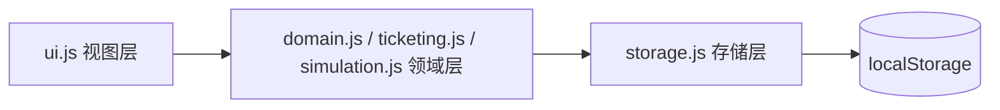

# 火车票销售模拟

一个**纯前端**（HTML5 + CSS3 + 原生 JavaScript，零依赖、零构建）的火车票销售模拟网站：
先登记基础数据（车站、线路、车次），再进行购票下单。系统按**「逐单区间适配」**规则自动出票：候补按时间戳升序逐单补录到区间空闲的座位（允许空洞，最大化座位利用率），并以彩色座位区间图直观呈现每个座位的票段分布。

所有数据保存在浏览器 `localStorage`，双击 `index.html` 即可离线使用。

## 在线演示

启用 GitHub Pages 后访问：<https://afewmoon.github.io/train-ticket-sales-simulation/>

> 首次启用自动化部署只需一步：仓库 **Settings → Pages → Build and deployment → Source 选择 `GitHub Actions`**，保存即可（详见下方「部署」章节）。

## 功能总览

| 模块 | 说明 |
|---|---|
| 车站 | 录入中英文名，自动分配全局唯一 3 位号码；被车次引用的车站禁止删除 |
| 线路 | 有序站序 + **大站（★）/小站标记**；内置「**四纵四横**」八条客运专线完整站表（京沪 24 站、京广深港 42 站、京哈 29 站、杭深 54 站 / 青太 24 站、徐兰 29 站、沪汉蓉 31 站、沪昆 53 站，共 274 座车站），大站为直辖市/省会/计划单列市/主要枢纽，跨线路共享车站自动去重 |
| 车次 | 车次号支持自定义（G/D/K + 4 位数字：首位 1~3/6~8、末位奇数，全局唯一）或随机生成；**可选挂接线路**，挂接后途经站候选随路线成形单调收缩（站序天然为线路子序列）；列表站序链高亮大站（★） |
| 购票 | 车次 → 合法区间（起点下标 < 终点下标）联动下拉；即时反馈「出票成功（座位号）」或「进入候补（第 N 位）」 |
| 订单与座位 | 订单状态表（已出票 / 候补中 / 座位号）+ 彩色座位区间图（大站以 ★ 标注） |
| 自动仿真 | 页面内自动化测试：基于所选线路一键生成**直达车 / 大站快车 / 隔站停车**三类车次并批量购票，参数可调、种子可复现（-1 为随机），统计卡片 + 车次摘要 + 分车次座位图，支持按 `sim` 标记一键清理 |

## 出票算法（逐单区间适配 · 在线补录）

> **规则**：候补订单按创建时间（createdAt）**升序逐单尝试补录**——只要某个座位的目标区间 `[起点, 终点)` 完全空闲，该订单即出票到该座位。座位允许存在空洞，**最大化座位利用率**。

- **在线机制**：候补队列按车次持久化（`tts:queues`，单条时戳有序列表），新订单 O(log W) 入队、出票 O(1) 出队；每次购票/退票仅对相关车次做一次补录扫描。
- **时戳补录**：先到的订单优先挑选座位；退票释放区间后，剩余候补立即按时间戳重新尝试填补，座位零空转。
- 座位分段占用用**差分数组 + 前缀和**统计，服务于剩余运力摘要与座位图渲染。
- **退票 / 取消候补**：订单表内一键操作，退票后自动触发补录。
- **退票模拟**：购票页候补卡片头部提供退票比率（默认 5%）与「退票模拟」按钮——按比率随机退票，释放区间后候补自动按时间戳补录，观察座位利用率的动态变化。
- **事件时间线**：购票、出票、候补、退票、兑现全部记录为事件（持久化、容量上限 500），购票页「购票下单」下方实时展示每个订单的落实情况。

## 版本

- **v1.0.0** — 逐单区间适配出票、在线候补补录、三类仿真车次、数据查询区、退票模拟与事件时间线
- **v0.2.0** — 四纵四横完整站表、自动仿真页、GitHub Pages 部署
- **v0.1.0** — 首个可用版本（车站/乘车人/车次登记、DAG 拼接出票、座位图）

## 数据查询

「订单与座位」页顶部查询区——按车次查看全部订单；按车次 + 相邻区间段查看该段已出票订单与座位。

## 自动仿真说明

「自动仿真」页在一条线路上按参数生成三类车次：

- **直达车**：仅在**两个大站**之间开行（中间不停靠），**G 字头**；
- **大站快车**：随机两个大站作为始发/终到（不一定为线路首末站），只停靠区间内大站，**G 字头**；
- **隔站停车**：起终点随机（不一定为线路首末站），相邻停靠站之间随机隔 1~3 站，**途经大站必停**，终点必停，**D 字头**。

可调参数：三类车次数、每车座位数、每车请求数、**随机种子**（-1 为随机种子，其余值结果完全可复现，运行后回显实际种子），也可选择自动生成模拟线路。仿真产生的全部实体带 `sim` 标记，「清理仿真数据」只回收这批数据，不触碰手动登记内容。

## 本地运行

```bash
# 方式一：直接双击 index.html

# 方式二：本地静态服务
python -m http.server 8931
# 访问 http://127.0.0.1:8931
```

## 项目结构

```
├── index.html          # 单页入口，七个标签面板
├── css/style.css       # 铁路蓝主题、卡片、座位图、仿真统计样式
├── js/
│   ├── storage.js      # localStorage 封装（统一前缀 tts:、JSON 容错）
│   ├── domain.js       # 领域层：车站/线路/车次 CRUD、校验、号码生成
│   ├── builtin.js      # 内置「四纵四横」线路与大/小站数据（首次运行种子化）
│   ├── ticketing.js    # 出票引擎：逐单区间适配、在线候补队列、差分/前缀和
│   ├── simulation.js   # 仿真引擎：三类车次生成、请求编排、统计与清理
│   ├── ui.js           # 视图层：渲染、联动、事件（不含业务逻辑）
│   └── app.js          # 初始化入口
├── AGENTS.md           # 架构约定与经验教训
├── LICENSE             # GPL-3.0
└── .nojekyll           # GitHub Pages 禁用 Jekyll
```

## 架构



## 部署（自动化，仅 master）

站点通过 GitHub Actions 从 `master` 自动部署——**推送即上线**，全程不产生、不维护任何部署分支。

- 工作流：`.github/workflows/deploy.yml`（`push` 到 `master` 或手动 `workflow_dispatch` 触发）；
- 链路：`actions/checkout` → `configure-pages` → `upload-pages-artifact` → `deploy-pages`；
- 权限：工作流内声明 `pages: write` / `id-token: write`，使用内置 GITHUB_TOKEN，无需密钥。

**首次启用（一次性）**：仓库 **Settings → Pages → Build and deployment → Source 选择 `GitHub Actions`** → Save。

> 历史说明：v0.2.0~v1.0.0 期间曾采用 `gh-pages` 分支部署，该分支已退役存档，不再参与部署。

## 许可

本项目以 [GPL-3.0](./LICENSE) 许可发布。
