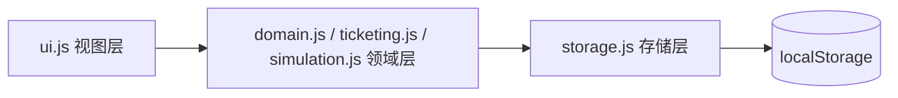

# 火车票销售模拟

一个**纯前端**（HTML5 + CSS3 + 原生 JavaScript，零依赖、零构建）的火车票销售模拟网站：
先登记基础数据（车站、线路、乘车人、车次），再进行购票下单。系统按**「座位区间首尾相接、恰好覆盖列车全程」**的规则自动出票，未满足条件的订单进入候补队列，并以彩色座位区间图直观呈现每个座位上的票段拼接效果。

所有数据保存在浏览器 `localStorage`，双击 `index.html` 即可离线使用。

## 在线演示

启用 GitHub Pages 后访问：<https://afewmoon.github.io/train-ticket-sales-simulation/>

> 首次开启只需一步：仓库 **Settings → Pages → Build and deployment → Source 选择 `Deploy from a branch`，Branch 选择 `gh-pages` / `(root)`**，保存即可（站点根目录已含 `.nojekyll`）。

## 功能总览

| 模块 | 说明 |
|---|---|
| 车站 | 录入中英文名，自动分配全局唯一 3 位号码；被车次引用的车站禁止删除 |
| 线路 | 有序站序 + **大站（★）/小站标记**；内置「**四纵四横**」八条客运专线（京沪、京广、京哈、杭深 / 徐兰、沪昆、青太、沪汉蓉），跨线路共享车站自动去重 |
| 乘车人 | 姓名 + 18 位身份证（真实校验位验证、号码唯一），列表脱敏展示 |
| 车次 | 随机生成唯一车次号（G/D/K + 数字）；**可选挂接线路**，挂接后站序必须为线路站序的**子序列**（支持大站快车、隔站停车等跳站模式） |
| 购票 | 乘车人 → 车次 → 合法区间（起点下标 < 终点下标）联动下拉；即时反馈「出票成功（座位号）」或「进入候补（第 N 位）」 |
| 订单与座位 | 订单状态表（已出票 / 候补中 / 座位号）+ 彩色座位区间图（大站以 ★ 标注） |
| 自动仿真 | 页面内自动化测试：基于所选线路一键生成**全程车 / 区间直达 / 大站快车 / 隔站停车**四类车次并批量购票，参数可调、种子可复现，统计卡片 + 车次摘要 + 分车次座位图，支持按 `sim` 标记一键清理 |

## 出票算法（DAG 路径搜索）

> **关键洞察**：一组票「严格首尾相接且恰好覆盖 [始发, 终到]」等价于：以候补订单区间为边、以站点下标为节点的有向无环图（DAG）上存在一条 **0 → 末站** 的路径。

- 每次购票请求触发一次扫描：按 `fromIdx` 建邻接桶，BFS 记录前驱（`prevOrder`），到达末站后回溯还原订单链，整组出票并分配到同一空闲座位；重复扫描直到无新路径或座位用尽。
- 单次扫描复杂度 O(S + W)（S 站数、W 候补订单数），远优于子集枚举 O(2^W)。
- 座位分段占用用**差分数组 + 前缀和**统计，同时服务于剩余运力摘要与座位图渲染定位。

## 自动仿真说明

「自动仿真」页在一条线路上按参数生成四类车次：

- **全程车**：停靠线路全部车站；
- **区间直达**：随机连续区段；
- **大站快车**：首站 + 末站 + 线路上标记的大站（★）；
- **隔站停车**：每隔一站停靠。

可调参数：四类车次数、每车座位数、乘车人数、每车请求数、**随机种子**（同一种子结果完全可复现），也可选择自动生成模拟线路。仿真产生的全部实体带 `sim` 标记，「清理仿真数据」只回收这批数据，不触碰手动登记内容。

## 本地运行

```bash
# 方式一：直接双击 index.html

# 方式二：本地静态服务
python -m http.server 8931
# 访问 http://127.0.0.1:8931
```

## 项目结构

```
├── index.html          # 单页入口，七个标签面板
├── css/style.css       # 铁路蓝主题、卡片、座位图、仿真统计样式
├── js/
│   ├── storage.js      # localStorage 封装（统一前缀 tts:、JSON 容错）
│   ├── domain.js       # 领域层：车站/线路/乘车人/车次 CRUD、校验、号码生成
│   ├── builtin.js      # 内置「四纵四横」线路与大/小站数据（首次运行种子化）
│   ├── ticketing.js    # 出票算法：DAG-BFS、座位分配、差分/前缀和
│   ├── simulation.js   # 仿真引擎：四类车次生成、请求编排、统计与清理
│   ├── ui.js           # 视图层：渲染、联动、事件（不含业务逻辑）
│   └── app.js          # 初始化入口
├── AGENTS.md           # 架构约定与经验教训
├── LICENSE             # GPL-3.0
└── .nojekyll           # GitHub Pages 禁用 Jekyll
```

## 架构



## 部署（gh-pages 分支）

站点位于仓库根目录，更新部署只需将 `master` 快进推送到 `gh-pages`：

```bash
git push origin master:gh-pages
```

首次开启：仓库 **Settings → Pages → Source: Deploy from a branch → Branch: `gh-pages` / root → Save**。

## 许可

本项目以 [GPL-3.0](./LICENSE) 许可发布。
